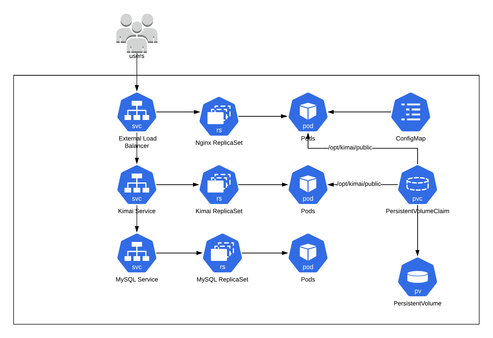

#  Kimai App K8 deployment

- Application URL:  

## Problem Statement: 
Q. Convert the Kimai WebApp to run on k8 platform with high availablity

## Architecture

## Setup instructions
*Note* : To run MySQL database use managed service like `RDS` or `CloudSQL`. This is for development purpose only. 
1. Create Namespace 

`kubectl create namespace kimai`

2. Setup MySQL service with persistent volumes

`kubectl apply -f mysql.yaml -n kimai`

3. Setup kimai application with shared volumes for `/opt/kimai/public` dir

`kubectl apply -f kimai.yaml`

4. Create configmap for Nginx

`kubectl apply -f nginx-configmap.yaml`

5. Setup Nginx service with external facing loadbalancer and configuration from configmap

`kubectl apply -f nginx.yaml`

## Challenges and k8 Solutions
1. Dynamic configuration for Nginx --> use configmap
2. Shared folder between application and nginx --> Use shared volume with persistent volumes
3. External access to Application  --> LoadBalancer with Nginx 
4. High Availablity --> Service with Replica Sets
5. Data persistence --> Persistent volumes

## Improvement and  optimizations
1. Use horizontal pod autoscaler to scale applications based on cpu,mem etc.
2. Use EFS or NFS for shared volumes
3. Use Ingress controller or Network policies to control application access
4. Setup TLS/SSL on service endpoint
5. Introduce service mesh using Istio or linkerd for improved security and observability
6. Monitoring application performance and metrics using prometheus or other applications

